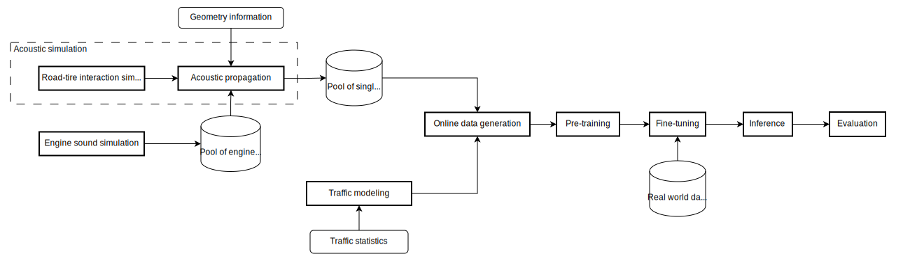

# Acoustic Traffic Simulation and Counting
Welcome to the repository of the acoustic based traffic monitoring system for the [DCASE 2024 Task 10](https://dcase.community/challenge2024/) .

This code also accompanies the publication of the ICASSP 2024 paper
"[Can Synthetic Data Boost the Training of Deep Acoustic Vehicle Counting Networks?](https://arxiv.org/abs/2401.09308)" by S.Damiano, L. Bondi, S. Ghaffarzadegan, A. Guntoro, T. van Waterschoot.


## Purpose of the project

This software is a research prototype, solely developed for and published as per the scope above. It will neither be maintained nor monitored in any way.

## Introduction

Acoustic traffic counting based on microphone arrays offers and alternative to vision, coil, and radar-based systems. When traffic density grows above a few vehicles per minute, data-driven solutions are often required to satisfy the precision requirement of end users. As per any data-driven system, more data leads to better performance, and often to higher costs.

This project aims at replacing large-scale acoustic data collection from real traffic scenarios with large-scale traffic simulation. Synthetic data is used to pre-train a model, and a small amount of real-world data is used to fine-tune the model.

The framework we propose is summarized by the following diagram.



Reading the diagram from left to right:

- Engine sounds are simulated via [enginesound](https://github.com/DasEtwas/enginesound) and stored. A pool of pre-computed engine sounds is made available on [Zenodo](https://zenodo.org/records/10700792).
- The sound of a moving vehicle in front of a microphone array (single pass-by) is simulated from the combination of engine sound and simulated road-tire interactions. Acoustic propagation, dependent on the geometry of a specific site, is used to generate a pool of single pass-bys. A single pass-by is a multi-channel audio file that simulates a linear trajectory of a vehicle at constant speed. A pool of pre-computed pass-bys is made available on [Zenodo](https://zenodo.org/records/10700792).
- Traffic statistics, e.g. number of vehicles per hour and road speed limit, are used to generate a traffic model, i.e. a distribution of pass-by events over time for different types of vehicles and direction of travel.
- A model is pre-trained on 60 seconds long segments generated online starting from the pool of single pass-by events and the traffic model.
- The model is fine-tuned on real data.
- Model inference and evaluation is performed on real data.

We are considering traffic scenarios with two lane roads, and two categories of vehicles: cars and commercial vehicles (cv). 
The task is to count number of vehicles per direction of travel (left, right) and vehicle type (car, cv) are passing by in 60 seconds of audio.

## Conceptual modules

The current repository is structured around three modules:

1. <strong>Modeling</strong>: from site specifications to traffic model (`atsc.modeling`)
    - Input: site specifications, including traffic statistics and geometry information.
    - Output: traffic model in the form of a list of pass-by events for different vehicle types, at different speed and direction of travel.
2. <strong>Simulation</strong>: from site specifications to acoustic simulation (`atsc.simulation`)
    - Input: site specifications, including traffic statistics and geometry information.
    - Output: simulated acoustic pass-bys audio files for each vehicle type and direction of travel, specific to a site location.
3. <strong>Counting</strong>: training, inference, and evaluation of acoustic traffic counting system. (`atsc.counting`)
    - Input: real or simulated acoustic data.
    - Output: counting of vehicles in each audio segment divided by vehicle type and direction of travel
(`car_left`, `car_right`, `cv_left`, `cv_right`).

## Data and directory structure

We have released real world data from six different locations covering various traffic conditions.
For each site, a pool of engine sounds, and single pass-by events are available for download
from [Zenodo](https://zenodo.org/records/10700792).

This repository works with three main folders, configurable in [dev.yaml](atsc/configs/env/dev.yaml):

- `real_root`: data collected from real world divided per location.
```
real_root
├── locX
│   ├── meta.json [contains meta information of traffic condition and sensor setup corresponding to the location]
│   ├── test [test flac files inside]
│   ├── test.csv
│   ├── train [train flac files inside]
│   ├── train.csv
│   ├── val [val flac files inside]
│   └── val.csv
```

- `engine_sound_dir`: engine sounds for each vehicle type.
```
engine_sound_dir
├── car [car engine sounds]
└── cv [commercial vehicles engine sounds]
```

- `work_folder`: folder where all artifacts and outputs are stored. This includes the `simulation` subfolder with simulated single pass-bys. You can download an example of simulated samples form Zenodo or simulate your own samples with the `atsc.simulation.events` module.

```
work_folder
├── modeling  [output of atsc.modeling.traffic module]
│   ├── locX
│   │   ├── train.csv [traffic model for simulated data, training set]
│   │   └── val.csv [traffic model for simulated data, validations set]
├── simulation  [output of atsc.simulation.events module, available pre-computed on Zenodo]
│   ├── locX
│   │   ├── car
│   │   │   ├── left [flac files with simulated single pass-bys inside]
│   │   │   └── right [flac files with simulated single pass-bys inside]
├── counting  [output of atsc.counting module]
│   ├── locX
│   │   ├── alias_a
│   │   │   ├── checkpoints  [output of atsc.counting.training module]
│   │   │   │   ├── best.ckpt [checkpoint with smallest validation loss]
│   │   │   │   └── last.ckpt [last checkpoint saved]
│   │   │   ├── inference  [output of atsc.counting.inference module]
│   │   │   │   └── test.csv [inference results on test split]
│   │   │   ├── evaluation  [output of atsc.counting.evaluation module]
│   │   │   │   └── test.csv [evaluation results on test split]
```

## Getting started

To set up the code, you have to do the following:

1) Clone this repository.
2) Make sure poetry is installed following [this](https://python-poetry.org/docs/) guide.
3) Set up and activate the Python environment:
```
poetry install
poetry shell
```
4) Download the dataset from [Zenodo](https://zenodo.org/records/10700792) and decompress `locX.zip` in `real_root/` and `engine-sounds.zip` in `engine_sound_dir/`, respectively.

## Replicating the baseline
For the baseline model, you need to:
1) **Configure**": Adjust folders in [dev.yaml](atsc/configs/env/dev.yaml).
2) **Modeling**: Create a traffic modeling system for each location using the meta-data provided for each site:
```bash
poetry run python -m atsc.modeling.traffic site=<locX>
```
The outputs of this code are two csv files `train.csv` and `val.csv` for each location saved at `<work_folder>/modeling`. Each file contains a list of pass-by events that are defined based on 4 parameters:
```
`vehicle_type`: car or commercial vehicles (cv) ,
`timestamp`: date and time of the day ,
`direction`: direction of travel: right or left,
`speed`: speed of the vehicle.
```
3) **Acoustic simulation**: Based on the generated traffic models from the previous step, generate pool of single pass-by events per site. 
```bash
poetry run python -m atsc.simulation.events site=<locX> simulation.num_workers=8
```
The outputs of this stage are audio files of single vehicle pass-by event for each vehicle type and travel direction specific for each site saved at `<work_folder>/simulation`.

This step can take quite some time. You can download pre-simulated data `simulation.zip` from
[Zenodo](https://zenodo.org/records/10700792) and extract it in `<work_folder>/simulation`.

4) **Training**: Train a regression model to count number of vehicles in 4 categories of `car_left`, `car_right`, `cv_left`, `cv_right`. As an example,
you can train your model using simulation data and later fine-tune it using real data.
Training on simulation:
```bash
poetry run python -m atsc.counting.training site=<locX> training.learning_rate=0.001 training/train_dataset=sim training/val_dataset=sim training.tags=["train-sim","val-sim"] training.alias=pretrain
```
Fine-tuning on real data:
```bash
poetry run python -m atsc.counting.training site=<locX> training.learning_rate=0.0001 training/train_dataset=real training/val_dataset=real training.tags=["train-real","val-real","finetune"] training.pretrained_model=pretrain training.alias=finetune
```

The output of this step is saved at `<work_folder>/counting`

5) **Model inference**: Run model inference on real data and the desired split (train, val, test).
```bash
poetry run python -m atsc.counting.inference site=<locX> inference.alias=finetune
```

The output of this step is saved at `<work_folder>/counting`

6) **Evaluation**: Calculate final metrics for your model:
```bash
poetry run python -m atsc.counting.evaluation site=<locX> inference.alias=finetune
```

The output of this step is saved at `<work_folder>/counting`

## Contributors

The code in this repository was curated by:

- Luca Bondi <luca.bondi@us.bosch.com>
- Stefano Damiano <stefano.damiano@ekuleuven.be>
- Winston Lin <winston.lin@us.bosch.com>
- Shabnam Ghaffarzadegan <shabnam.ghaffarzadegan@us.bosch.com>

## License

Acoustic Traffic Simulation and Counting is open-sourced under the GPL-3.0 license. See the [LICENSE](LICENSE) file for details.

For a list of other open source components included in Acoustic Traffic Simulation and Counting, see the file [3rd-party-licenses.txt](3rd-party-licenses.txt).
